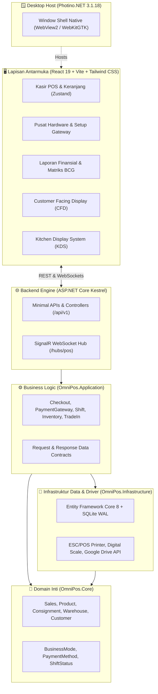

# 🛍️ OmniPOS Enterprise — Multi-Business POS & Retail Management System

<div align="center">


**Sistem Kasir & Manajemen Bisnis Modern, Mandiri (*Local-First*), Berperforma Tinggi, dan Siap Pakai untuk Segala Jenis Usaha Retail & Jasa.**

[](https://dotnet.microsoft.com/)
[](https://react.dev/)
[](https://tailwindcss.com/)
[](https://sqlite.org/)
[](https://github.com/AlvinBasari/OmniPOS)
[](#-arsitektur-teknologi)
[](#-hak-cipta--pengembang)

[Fitur Unggulan](#-fitur-unggulan-utama) • [Edisi Bisnis](#-5-edisi-bisnis-dalam-1-aplikasi) • [Modul Sistem](#-modul--kemampuan-sistem) • [Panduan Instalasi](#-panduan-instalasi--menjalankan) • [Rilis Windows](#-rilis--deployment-windows)

</div>

---

## 📖 Tentang OmniPOS

**OmniPOS** adalah sistem *Point of Sale* (POS) dan pengelolaan operasional ritel enterprise yang dirancang dengan filosofi **Local-First & Zero Cloud Lock-in**. Aplikasi ini dapat berjalan 100% secara mandiri tanpa ketergantungan koneksi internet, menjamin kelancaran transaksi kasir tanpa risiko *downtime* atau server down.

Dibangun dengan arsitektur modern memadukan backend berperforma tinggi **ASP.NET Core (.NET 8)**, engine desktop ringan **Photino.NET** (< 60MB RAM footprint tanpa bloatware Chromium), dan antarmuka web interaktif **React 19 + Tailwind CSS** yang mendukung tema visual dinamis.

---

## 🌟 Fitur Unggulan Utama

- ⚡ **100% Offline-First**: Database lokal SQLite dalam mode *Write-Ahead Logging (WAL)* berkecepatan tinggi. Data tersimpan aman di komputer toko Anda.
- 📱 **QRIS Dinamis Interkoneksi Nasional (EMVCo MPM & ASPI)**: Otomatis mengunci nominal transaksi dan invoice kasir ke dalam kode QR. Dilengkapi *auto-settlement polling*, radar status real-time, timer countdown, simulator bawaan, dan webhook gateway (Midtrans, Xendit, Tripay).
- 💳 **Mesin EDC Dual-Mode (Debit & Kredit)**: Mendukung operasional kasir Indonesia (*BCA, Mandiri, BRI, BNI, CIMB, Permata, dll.*) baik melalui **Mode Standalone (Manual Slip)** dengan pencatatan Approval Code & 4 digit kartu, maupun **Mode ECR Direct Link** via kabel Serial RS-232 / LAN TCP/IP.
- 🔄 **Modul Tukar Tambah (Trade-In & Buyback Center)**: Diagnosa fisik 8-titik, kalkulator pemotongan minus otomatis, *auto-grading* unit second (Grade A-E), penerbitan Surat Perjanjian Jual Beli (SPJB) format legal A4/Thermal, dan potongan DP kasir otomatis.
- 🏢 **Multi-Gudang & Transfer Stok Antar Cabang**: Pengiriman stok antar gudang dengan status *in-transit*, cetak Surat Jalan resmi format A4, cetak Label Koli Thermal, serta verifikasi fisik saat barang tiba dengan deteksi selisih (*discrepancy alert*).
- 🤝 **Konsinyasi Barang Titipan Vendor**: Pencatatan produk titipan, penerimaan barang (*intake*), pengembalian retur vendor, rekap bagi hasil otomatis, serta cetak bukti pembayaran (*settlement voucher*) A4 & thermal.
- 📊 **Laporan Finansial SAK EMKM & Matriks BCG**: Laporan Laba Rugi komprehensif, Laporan Arus Kas (*Cash Flow*), Posisi Keuangan Neraca (*Balance Sheet*), Analisis Kuadran Portofolio Produk BCG (*Stars, Cash Cows, Opportunities, Underperformers*), serta Buku Besar (*General Ledger*).
- 🖨️ **Hardware Hub Terpadu**: Integrasi langsung ke Printer Struk Thermal (RAW USB, Windows Spooler, CUPS Linux, Network LAN TCP 9100), Laci Kasir RJ-11, Timbangan Digital RS-232, Barcode Scanner USB HID, dan Kamera HP Android via Wi-Fi lokal.
- 📺 **Customer Facing Display (CFD) & Kitchen Display (KDS)**: Sinkronisasi real-time monitor kedua untuk pelanggan dan layar dapur restoran menggunakan SignalR WebSocket lokal tanpa server eksternal.
- 🎨 **Tema Visual Dinamis**: Pilihan tema *Modern Light*, *Deep Zinc Dark*, *High Contrast Mono*, dan *Warm Linen* dengan adaptasi token CSS yang konsisten di seluruh modul.

---

## 🏬 5 Edisi Bisnis dalam 1 Aplikasi

OmniPOS memiliki kemampuan preset multi-industri dengan database mandiri yang terisolasi:

```
+-----------------------------------------------------------------------------------+
|                              OMNIPOS CORE ENGINE                                  |
+---------------------+--------------------+-------------------+--------------------+
|  🛒 RETAIL & SEMBAKO| 🍽️ F&B RESTO & KAFE| ✂️ SERVICES & JASA | 💊 APOTEK & FARMASI|
|  - Barcode Kilat    | - Denah Meja Visual| - Antrean & SPK   | - FEFO & Expired   |
|  - Grosir Bertingkat| - Layar Dapur (KDS)| - Komisi Staf     | - No. Batch Pabrik |
|  - Timbangan Digital| - Resep BOM        | - Booking Layanan | - Resep Dokter     |
+---------------------+--------------------+-------------------+--------------------+
|               📱 GADGET & ELEKTRONIK (IMEI, Servis, Garansi & Trade-In)            |
+-----------------------------------------------------------------------------------+
```

1. **🛒 Retail, Minimarket & Sembako (`retail`)**:
   - Pemindaian barcode berkelanjutan (*continuous scanner*).
   - Harga grosir bertingkat (misal: Beli $\ge$ 3 diskon Rp 2.000).
   - Multi-satuan konversi (Pcs, Renteng, Dus, Sak).
   - Integrasi timbangan digital barang curah (beras, telur, buah).
   - Buku kasbon & limit piutang pelanggan.

2. **🍽️ Resto, Kafe & Bakery (`resto`)**:
   - Denah meja interaktif (Meja Kosong, Terisi, Billing).
   - Kitchen Display System (KDS) & cetak tiket dapur otomatis.
   - Manajemen varian (Level Pedas, Gula, Topping).
   - Resep bahan baku (*Bill of Materials*) dan pemotongan stok otomatis.
   - Split Bill (Pisah Pembayaran per Meja).

3. **✂️ Layanan, Barbershop & Laundry (`services`)**:
   - Manajemen antrean pengerjaan jasa (*Queueing System*).
   - Pelacakan status pengerjaan (Antre $\rightarrow$ Dikerjakan $\rightarrow$ Selesai $\rightarrow$ Diambil).
   - Penugasan teknisi/kapster dengan perhitungan komisi staf otomatis.
   - Tanda terima SPK layanan dan uang muka (DP).

4. **💊 Apotek & Toko Obat (`pharmacy`)**:
   - Pelacakan First-Expired-First-Out (FEFO) dan nomor batch pabrik.
   - Radar peringatan dini obat mendekati tanggal kadaluarsa.
   - Input resep dokter, dosis aturan pakai, dan cetak etiket obat otomatis.

5. **📱 Gadget, Elektronik & Servis (`electronics`)**:
   - Pelacakan nomor IMEI dan Serial Number unik per unit.
   - Modul Tukar Tambah (*Trade-In*) unit bekas bergaransi.
   - Penerbitan kartu garansi toko & SPK tanda terima servis unit.
   - Manajemen nomor perdana cantik & paket kuota voucher data.

---

## 🛠️ Arsitektur Teknologi

OmniPOS mengimplementasikan prinsip **Clean Architecture**:



---

## 📁 Struktur Repositori

```bash
OmniPOS/
├── src/
│   ├── OmniPos.Core/             # Domain Entities, Enums, & Interface Abstractions
│   ├── OmniPos.Application/      # DTOs, PaymentGatewayService, Checkout, Reporting
│   ├── OmniPos.Infrastructure/   # AppDbContext, Seeders, Hardware Drivers (ESC/POS, Timbangan)
│   ├── OmniPos.Server/           # ASP.NET Core REST Endpoints, SignalR PosHub, Static File Host
│   │   └── wwwroot/              # Build Assets Frontend (HTML, Compiled React JS/CSS)
│   ├── OmniPos.Desktop/          # Photino.NET Desktop Shell Launcher & Browser Fallback
│   └── OmniPos.Client/           # Frontend React 19, Vite, Tailwind CSS, Zustand Stores
├── publish/
│   ├── win-x64/                  # Output Biner Windows (.exe + DLLs)
│   └── linux-x64/                # Output Biner Linux Desktop (WebKitGTK)
├── assets/                       # Icon aplikasi & aset grafis
├── installer-windows.iss         # Skrip Inno Setup Compiler Windows
├── install.bat                   # Batch Setup Wizard Windows (Shortcut & Setup Otomatis)
├── install.sh                    # Skrip Instalasi Linux
├── run-omnipos.sh                # Launcher Linux cepat
└── README.md
```

---

## 🚀 Panduan Instalasi & Menjalankan

### Kebutuhan Sistem (Prerequisites)
- **.NET SDK 8.0** ([Download .NET 8](https://dotnet.microsoft.com/download/dotnet/8.0))
- **Node.js 18+** & npm ([Download Node.js](https://nodejs.org/))
- **OS**: Windows 10/11 (64-bit) atau Linux (Ubuntu 22.04+, Debian, Fedora, Arch)

---

### 1. Menjalankan Mode Pengembangan (Development)

#### Terminal 1 — Backend & Desktop Shell:
```bash
# Clone repositori
git clone https://github.com/AlvinBasari/OmniPOS.git
cd OmniPOS

# Restore & jalankan backend (pilih edisi: retail, resto, services, pharmacy, electronics)
dotnet run --project src/OmniPos.Desktop/OmniPos.Desktop.csproj -e retail
```

#### Terminal 2 — Frontend Hot-Reload:
```bash
cd src/OmniPos.Client
npm install
npm run dev
```
*Buka browser di `http://localhost:5173` untuk melihat tampilan dengan Vite Hot-Reload.*

---

### 2. Membangun & Mengompilasi Rilis Produksi (Production Build)

```bash
# 1. Kompilasi bundle frontend React
cd src/OmniPos.Client
npm run build

# 2. Salin aset ke wwwroot Server
cp -r dist/* ../OmniPos.Server/wwwroot/

# 3. Terbitkan biner desktop Linux:
dotnet publish src/OmniPos.Desktop/OmniPos.Desktop.csproj -c Release -r linux-x64 --no-self-contained -o publish/linux-x64

# 4. Terbitkan biner desktop Windows:
dotnet publish src/OmniPos.Desktop/OmniPos.Desktop.csproj -c Release -r win-x64 --no-self-contained -o publish/win-x64
```

---

## 🪟 Rilis & Deployment Windows

Untuk mendistribusikan aplikasi kepada pengguna Windows di toko kasir:

### Metode 1: Installer Mandiri Siap Pakai (`OmniPOS-Setup.exe`) — Paling Praktis
1. Langsung jalankan file installer yang sudah dikompilasi di:
   ```
   publish/installer/OmniPOS-Setup.exe
   ```
2. Setup Wizard interaktif akan memandu pemilihan edisi bisnis (Retail, Resto, Jasa, Apotek, Gadget), lokasi instalasi, dan pembuatan shortcut Desktop & Start Menu secara otomatis.
3. Mendukung fitur instalasi baru, perbaikan (*repair*), ganti edisi toko, serta *uninstaller* resmi di Windows Settings / Control Panel.

### Metode 2: Menggunakan Inno Setup Compiler
1. Buka file [`installer-windows.iss`](installer-windows.iss) menggunakan **Inno Setup**.
2. Klik tombol **Compile** (`Ctrl + F9`).
3. File installer alternatif akan dibuat di `publish/installer/OmniPOS-Enterprise-Setup-v1.0.0.exe`.

### Metode 3: Menggunakan Batch Setup Wizard (`install.bat`)
1. Salin seluruh folder aplikasi ke komputer kasir Windows (misal di `C:\OmniPOS`).
2. Klik kanan file [`install.bat`](install.bat) dan pilih **Run as Administrator**.
3. Pilih nomor edisi bisnis toko yang ingin dipasang (1-6).
4. Skrip PowerShell bawaan akan otomatis membuat file `.lnk` shortcut di Layar Desktop dan Start Menu Windows.

---

## 🐧 Menjalankan di Linux

Pada lingkungan Linux (Ubuntu, Debian, dll.):
```bash
# Berikan izin eksekusi launcher
chmod +x run-omnipos.sh

# Jalankan edisi retail
./run-omnipos.sh retail

# Atau jalankan edisi lainnya
./run-omnipos.sh resto
./run-omnipos.sh electronics
```

---

## 🔐 Akun & Kredensial Default

Setelah database pertama kali diinisialisasi otomatis oleh sistem (*Seeder*), gunakan PIN berikut untuk masuk:

| Akun / Peran | Nama | Default PIN | Akses |
|---|---|:---:|---|
| **SuperAdmin** | Admin Utama | `123456` | Akses Penuh: Kasir, Laporan, Keuangan, Karyawan, Database & Hardware |
| **Kasir (Cashier)** | Siti Rahma | `111111` | Operasional Kasir, Buka/Tutup Shift, Retur Penjualan, Hardware Kasir |
| **Supervisor** | Budi Santoso | `222222` | Otorisasi Diskon Khusus, Batal Transaksi, Audit Shift |
| **Staff Gudang** | Dedi Gudang | `333333` | Penerimaan Barang, Multi-Warehouse Transfer, Stock Opname |

---

## 📄 Format Dokumen & Cetak yang Didukung

- **Printer Struk Thermal (58mm & 80mm)**:
  - Struk Kasir Penjualan Lunas (dengan rincian PPN, diskon, RRN QRIS / Otorisasi EDC).
  - Struk SPJB Tukar Tambah Titipan Unit.
  - Struk Bukti Pengeluaran Kas Operasional / Kasbon.
  - Ringkasan Laporan Penutupan Shift Kasir (Z-Report).
  - Ringkasan Eksekutif Finansial & Laba Rugi Toko.
- **Printer Standar Dokumen (Kertas A4 / PDF)**:
  - Surat Perjanjian Jual Beli (SPJB) Legal Bermaterai Unit Bekas (Trade-In).
  - Surat Jalan Pengiriman Stok Antar Gudang / Cabang Resmi.
  - Voucher Bagi Hasil & Rekonsiliasi Vendor Konsinyasi.
  - Laporan Keuangan Standar Akuntansi Keuangan (SAK EMKM) dengan kolom tanda tangan pengesahan Direktur / Supervisor / Staff.

---

## ⚖️ Hak Cipta & Pengembang

Dikembangkan dan dipelihara secara profesional oleh:
**BASARI IT SOLUTIONS** (Indonesia)
*Enterprise Point of Sale & Business Software Engineering*
- **Situs Web**: [https://github.com/AlvinBasari/OmniPOS](https://github.com/AlvinBasari/OmniPOS)
- **Repositori Resmi**: `git@github.com:AlvinBasari/OmniPOS.git`

*Hak Cipta © 2026 BASARI IT SOLUTIONS. Seluruh hak cipta dilindungi undang-undang.*
