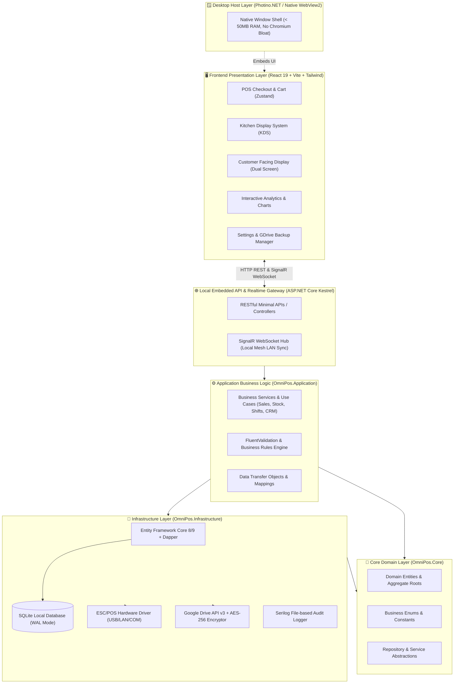
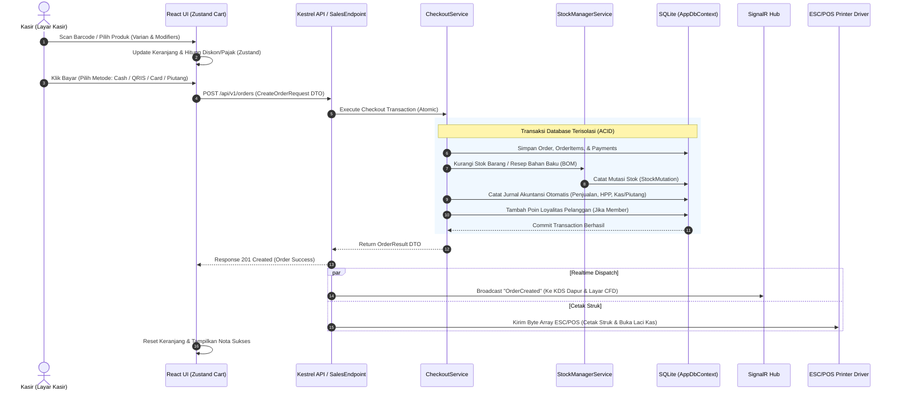
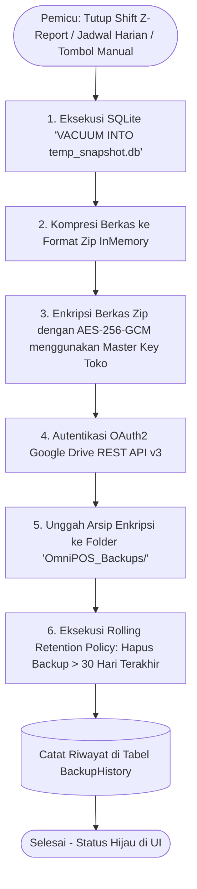

# Dokumen Arsitektur Sistem & Desain Perangkat Lunak
## OmniPOS - Enterprise-Grade Multi-Business POS System
### Local-First, .NET High-Performance Engine, Modern React/Tailwind UI & Cloud Backup

---

## 1. Ikhtisar Arsitektur Tingkat Tinggi (High-Level Architecture)

OmniPOS mengadopsi pola **Clean Architecture (Onion/Layered Architecture)** yang dipadukan dengan pendekatan **Local-First & Hybrid Desktop Web Host**. Arsitektur ini memisahkan secara tegas antara aturan bisnis inti (*Core Business Logic*), infrastruktur akses data (*Data & Hardware Access*), dan lapisan antarmuka pengguna (*Modern Web UI*).



---

## 2. Pemilihan Stack Teknologi & Justifikasi Teknis

| Komponen | Teknologi Terpilih | Alasan & Keunggulan |
| :--- | :--- | :--- |
| **Backend & Core Runtime** | **.NET 8 / 9 (C#)** | Eksekusi sangat cepat, kompilasi AOT/JIT efisien, konsumsi memori rendah, stabil dijalankan non-stop di PC kasir. |
| **Desktop Shell** | **Photino.NET / Native WebView2** | Menggunakan webview bawaan OS (Edge WebView2 di Windows / WebKit di Linux). **Hanya membutuhkan RAM ~40-60 MB** (jauh lebih ringan dibanding Electron yang memakan 300+ MB RAM). |
| **Frontend Framework** | **React 19 + TypeScript + Vite** | Ekosistem UI terlengkap di dunia: reaktivitas instan, modularitas komponen, dan dukungan pustaka visual modern tanpa batas. |
| **Styling & Design System** | **TailwindCSS v3/v4 + Shadcn UI / Radix Primitives + Lucide Icons** | Tampilan *ultra-slick*, *glassmorphism*, dark/light mode bawaan, micro-animations, dan sangat mudah dikustomisasi sesuai tema toko. |
| **State Management** | **Zustand + TanStack React Query** | Sangat ringan, reaktif, mengelola keranjang belanja, sesi kasir, dan cache data lokal tanpa *boilerplate* rumit. |
| **Database Lokal** | **SQLite + Entity Framework Core + Dapper** | *Zero-configuration* (file tunggal `pos_data.db`), mendukung transaksi ACID, mode **WAL (Write-Ahead Logging)** yang kebal mati listrik, dan Dapper untuk query laporan kilat. |
| **Real-time Local Sync** | **ASP.NET Core SignalR** | Mengirimkan pesanan dari tablet pelayan ke kasir & layar dapur (KDS) via Wi-Fi lokal secara instan $(<10\text{ ms})$ tanpa internet. |
| **Cloud Backup & Enkripsi** | **Google.Apis.Drive.v3 + System.Security.Cryptography (AES-256-GCM)** | Backup otomatis langsung ke akun Google Drive pemilik toko (bebas biaya server). Data terenkripsi dengan standar perbankan. |
| **Hardware Communication** | **ESC-POS Protocol (Raw Sockets / SerialPort / USB HID)** | Kompatibel 100% dengan semua printer thermal standar (58mm/80mm), pembuka laci kas (*cash drawer kick*), barcode scanner, dan timbangan digital. |

---

## 3. Struktur Direktori Proyek (Solution Structure)

```
omnipos/
├── docs/
│   ├── prd.md                                # Product Requirements Document
│   └── arsitektur.md                         # Dokumen Arsitektur & Desain Kode
│
├── src/
│   ├── OmniPos.Core/                         # [Layer 1] Domain Entities, Enums & Abstractions
│   │   ├── Entities/
│   │   │   ├── Products/                     # Product, ProductVariant, Category, Modifier, Recipe (BOM)
│   │   │   ├── Inventory/                    # Stock, StockMutation, BatchExpiry, SerialNumber, Supplier, PurchaseOrder
│   │   │   ├── Sales/                        # Order, OrderItem, OrderItemModifier, Payment, Promotion, HoldOrder
│   │   │   ├── Shifts/                       # Shift, CashTransaction (Petty Cash)
│   │   │   ├── CRM/                          # Customer, CustomerPoint, CustomerReceivable (Kasbon), CustomerDeposit
│   │   │   ├── Tables/                       # Table, FloorPlanArea
│   │   │   ├── Finance/                      # Account, JournalEntry, JournalDetail
│   │   │   └── Identity/                     # User, Role, Permission, AuditLog
│   │   ├── Enums/                            # Business Enums (OrderStatus, PaymentMethod, BusinessMode, etc.)
│   │   └── Interfaces/                       # Abstraksi Repository, IUnitOfWork, IPrinterService, IBackupService
│   │
│   ├── OmniPos.Application/                  # [Layer 2] Business Logic, CQRS / Service Handlers & DTOs
│   │   ├── Common/                           # Result Pattern, Exceptions, Behaviors, Pagination
│   │   ├── DTOs/                             # Data Transfer Objects (Request/Response)
│   │   ├── Services/                         # Business Logic Implementation
│   │   │   ├── Sales/                        # CheckoutService, DiscountEngine, QRISGeneratorService
│   │   │   ├── Inventory/                    # StockManagerService, HppCalculatorService (FIFO/Avg), BOMService
│   │   │   ├── Shifts/                       # ShiftService, CashReconciliationService (X/Z Reports)
│   │   │   ├── CRM/                          # CustomerService, PointRewardService, ReceivableService
│   │   │   ├── Finance/                      # AutoJournalService, FinancialReportService
│   │   │   ├── Backup/                       # BackupOrchestratorService
│   │   │   └── Hardware/                     # PrintingOrchestratorService
│   │   └── Validators/                       # FluentValidation Rules (OrderValidator, ProductValidator, etc.)
│   │
│   ├── OmniPos.Infrastructure/               # [Layer 3] Database, External APIs & Hardware Drivers
│   │   ├── Data/
│   │   │   ├── AppDbContext.cs               # EF Core DbContext
│   │   │   ├── Configurations/               # Entity Configurations (Fluent API)
│   │   │   ├── Migrations/                   # EF Core Migration Files
│   │   │   └── Repositories/                 # Generic & Specific Repositories
│   │   ├── Services/
│   │   │   ├── Backup/
│   │   │   │   ├── Aes256Encryptor.cs        # AES-256-GCM File Encryption & Decryption
│   │   │   │   ├── GoogleDriveService.cs     # Google Drive API v3 Client & OAuth2 Handler
│   │   │   │   └── BackupRetentionPolicy.cs  # Rolling 30-day auto-purge policy
│   │   │   ├── Hardware/
│   │   │   │   ├── EscPosPrinterDriver.cs    # Driver Thermal USB, LAN/TCP, Bluetooth
│   │   │   │   ├── CashDrawerDriver.cs       # Kick Drawer Pulse Sender
│   │   │   │   └── DigitalScaleDriver.cs     # Serial RS-232 / USB Weight Scale Reader
│   │   │   └── Security/
│   │   │       ├── PasswordHasher.cs         # BCrypt / PBKDF2 Hasher untuk PIN & Password
│   │   │       └── AuditLogger.cs            # Local Audit Trail Logger
│   │   └── Seeders/                          # Initial Database Seeder (Admin User, Default COA, Settings)
│   │
│   ├── OmniPos.Server/                       # [Layer 4] ASP.NET Core Kestrel Host & Web API Endpoints
│   │   ├── Controllers/ (atau Minimal APIs)  # REST API Routes (/api/v1/sales, /api/v1/products, dll)
│   │   ├── Hubs/                             # SignalR Hubs (PosHub untuk KDS, CFD, & Multi-Terminal Sync)
│   │   ├── Middleware/                       # Global Exception Handler, Request Logging, Auth Middleware
│   │   ├── appsettings.json                  # Konfigurasi Port, Database Path, GDrive Client ID
│   │   └── Program.cs                        # Server Entry Point & Dependency Injection Container
│   │
│   ├── OmniPos.Desktop/                      # [Layer 5] Native Desktop Launcher (Photino.NET Shell)
│   │   ├── Program.cs                        # Inisialisasi Kestrel Server + Membuka Window Native Photino
│   │   └── Assets/                           # App Icon, Splash Screen
│   │
│   └── OmniPos.Client/                       # [Layer 6] Modern Web UI (React 19 + TypeScript + Vite + Tailwind)
│       ├── public/                           # Static assets, sounds (beep sound on scan)
│       ├── src/
│       │   ├── assets/                       # Images, SVG logos, banner assets
│       │   ├── components/                   # Reusable Component Library
│       │   │   ├── ui/                       # Shadcn UI (Button, Dialog, Input, Dropdown, Table, Card, Tabs, Badge)
│       │   │   ├── pos/                      # ProductGrid, BarcodeScannerInput, CartList, PaymentModal, SplitBillModal
│       │   │   ├── fnb/                      # FloorPlanCanvas, TableNode, ModifiersModal, MoveTableModal
│       │   │   ├── kds/                      # KitchenOrderCard, StationFilterBar, TimerBadge
│       │   │   ├── inventory/                # StockAdjustmentModal, BatchExpiryPicker, RecipeBOMBuilder
│       │   │   ├── crm/                      # CustomerPickerModal, KasbonPaymentDialog, DepositTopupModal
│       │   │   ├── shifts/                   # OpenShiftModal, CloseShiftBlindCount, PettyCashModal
│       │   │   ├── backup/                   # GDriveAuthStatus, BackupHistoryTable, RestoreConfirmModal
│       │   │   └── layout/                   # Sidebar, TopNavbar, QuickLockScreen, ActiveShiftBanner
│       │   ├── hooks/                        # Custom React Hooks (useCart, useBarcodeScanner, useHotkeys, useSignalR)
│       │   ├── pages/                        # Halaman Utama
│       │   │   ├── PosPage.tsx               # Layar Kasir Utama
│       │   │   ├── TablesPage.tsx            # Layar Denah Meja (F&B)
│       │   │   ├── KdsPage.tsx               # Layar Kitchen Display System (Dapur)
│       │   │   ├── CfdPage.tsx               # Layar Customer Facing Display (Layar Kedua)
│       │   │   ├── InventoryPage.tsx         # Manajemen Produk & Stok
│       │   │   ├── ShiftsPage.tsx            # Manajemen Shift & Kas Laci
│       │   │   ├── CustomersPage.tsx         # CRM, Poin & Buku Piutang
│       │   │   ├── ReportsPage.tsx           # Laporan Finansial & Grafik Analitik
│       │   │   ├── AccountingPage.tsx        # Buku Besar & Jurnal Otomatis
│       │   │   └── SettingsPage.tsx          # Konfigurasi Toko, Printer & Google Drive
│       │   ├── services/                     # API Client (Axios/Ky instance, REST Services, SignalR Hub Client)
│       │   ├── store/                        # Zustand Global Stores (useCartStore, useAuthStore, useShiftStore, useThemeStore)
│       │   ├── types/                        # TypeScript Interface definitions & Enums
│       │   ├── utils/                        # Currency Formatter (Rupiah), Date Helpers, ESC/POS Receipt Formatter
│       │   ├── App.tsx                       # Router & Layout Container
│       │   └── main.tsx                      # Entry point React
│       ├── tailwind.config.js
│       ├── vite.config.ts
│       └── package.json
│
└── OmniPos.sln                               # Visual Studio / .NET Solution File
```

---

## 4. Pola Desain & Alur Data (Data Flow & Patterns)

### 4.1. Alur Transaksi Penjualan (Checkout Flow)



---

## 5. Subsistem Kunci & Desain Teknis

### 5.1. Database Engine & Konfigurasi SQLite WAL
Untuk memastikan performa baca-tulis tinggi dan proteksi 100% dari korupsi data saat listrik padam mendadak:
* **Pragma Settings**:
  ```sql
  PRAGMA journal_mode = WAL;          -- Mengaktifkan Write-Ahead Logging (Non-blocking concurrent reads)
  PRAGMA synchronous = NORMAL;        -- Mengoptimalkan kecepatan disk I/O dengan keamanan transaksi terjamin
  PRAGMA busy_timeout = 5000;         -- Menunggu hingga 5 detik jika database terkunci sebelum melempar error
  PRAGMA foreign_keys = ON;           -- Memastikan integritas relasi tabel terjaga
  PRAGMA temp_store = MEMORY;         -- Menyimpan tabel temporary di RAM untuk kecepatan query
  ```
* **Kalkulasi Finansial**: Semua kolom uang (Harga, Diskon, Subtotal, Pajak, Total, Saldo) menggunakan tipe `decimal(18,2)` di C# dan `TEXT / REAL` terkalibrasi di SQLite untuk mencegah *floating-point rounding error*.

---

### 5.2. Subsistem Google Drive Backup & Enkripsi AES-256



* **Keamanan Enkripsi**:
  - Algoritma: **AES-256-GCM (Galois/Counter Mode)** dengan Nonce/IV unik 12-byte dan Authentication Tag 16-byte untuk memastikan data tidak dapat dimanipulasi pihak ketiga.
* **Fitur 1-Click Restore**:
  1. Unduh file `.enc` dari Google Drive.
  2. Dekripsi dan verifikasi checksum SHA-256.
  3. Buat salinan darurat (*safety backup*) database saat ini.
  4. Timpa file `pos_data.db` dan lakukan migrasi skema otomatis.

---

### 5.3. Subsistem Hardware & Printing Engine (ESC/POS)
* **Konektivitas Driver**:
  - **USB Direct / Windows Spooler**: Kirim RAW Bytes langsung ke port printer tanpa dialog print sistem operasi.
  - **Network LAN / Wi-Fi (Raw TCP Port 9100)**: Untuk printer dapur yang berjarak jauh dari meja kasir.
  - **Bluetooth SPP / Virtual COM**: Untuk printer thermal portabel.
* **Fitur Cetak Struk**:
  - Header Toko & Logo Bitmap 1-bit monokrom.
  - Detail Pembelian, Diskon, Pajak, Service Charge, Pembulatan.
  - Barcode / QR Code Nota (memudahkan pencarian nota saat retur).
  - Footer Promo / Info Wi-Fi.
  - Perintah ESC/POS Kick Drawer (`ESC p 0 25 250`) untuk membuka laci kas secara mekanik.
  - Perintah ESC/POS Cut Paper (`GS V 66 0`) untuk memotong kertas struk secara otomatis.

---

### 5.4. Subsistem Multi-Terminal Local Mesh (Offline Wi-Fi Network)
* **Master PC (Local Server)**:
  - Menjalankan instance Kestrel di `http://0.0.0.0:5000`.
* **Worker Terminals (Tablet Waiter / Layar Dapur / Layar Kasir Tambahan)**:
  - Perangkat pelayan cukup membuka alamat IP lokal PC Master (misal: `http://192.168.1.100:5000`) melalui browser Chrome/Safari pada tablet atau aplikasi klien ringan.
  - Berkomunikasi dua arah via **SignalR WebSockets**:
    - Channel `KitchenStation`: Menerima tiket pesanan baru dari pelayan/kasir seketika.
    - Channel `TableStatus`: Memperbarui warna status meja saat ada pelanggan baru atau saat meja dibersihkan.
    - Channel `CfdDisplay`: Mengirim daftar belanjaan dan QRIS ke monitor pelanggan.

---

## 6. Standar Koding & Konvensi Pengembangan

1. **Prinsip SOLID & Clean Architecture**:
   - `OmniPos.Core` sama sekali tidak memiliki dependensi ke layer luar (Zero Dependencies).
   - Seluruh interaksi database diakses melalui interface repository dan *Service Layer*.
2. **Result Pattern**:
   - Menghindari penggunaan `throw Exception` untuk validasi bisnis; menggunakan `Result<T>` atau `Result.Failure(errorMessage)` untuk performa optimal.
3. **Frontend UI Patterns (React)**:
   - Komponen berbasis fungsional (*Functional Components*) dengan TypeScript *Strict Mode*.
   - Pemisahan antara *Presentational Components* (UI murni) dan *Container/Page Components* (State & Logic).
   - Aksesibilitas keyboard penuh: setiap tombol penting memiliki *hotkey* (F1-F12, Enter, Esc).
4. **Keamanan & Privasi Data**:
   - Kata sandi dan PIN kasir di-hash menggunakan algoritma **BCrypt / PBKDF2**.
   - Kunci enkripsi Google Drive disimpan secara aman di DPAPI (*Data Protection API*) Windows / Keychain lokal.

---

*Dokumen arsitektur ini merupakan panduan baku perancangan kode, struktur berkas, dan implementasi teknis untuk sistem OmniPOS.*
