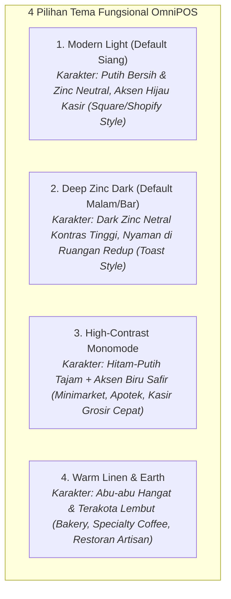
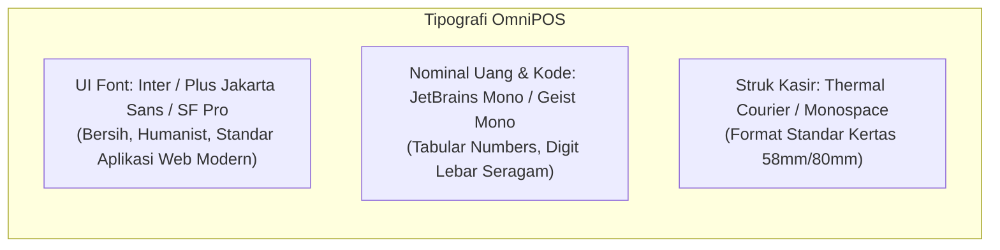

# Standar Desain & Panduan UX/UI
## OmniPOS - Sistem Kasir Multi-Bisnis Mandiri
### Konsep: "Pragmatic Utilitarian & Modern Clean" (Standar Square, Toast & Shopify POS)

---

## 1. Konsep & Identitas Visual Utama

Desain OmniPOS berfokus penuh pada **kegunaan nyata (utilitarian), ketahanan mata kasir, dan kecepatan operasional toko**. 

Kami **menghindari elemen visual berlebihan (gimmick/AI-slop)** seperti efek neon menyala, gradien warna ungu-cyan dekoratif, atau transparansi blur berlebihan yang membebani performa perangkat kasir.

Sebagai gantinya, antarmuka mengadopsi standar industri perangkat lunak kasir komersial terkemuka (seperti **Square POS, Toast POS, dan Shopify POS**):
* **Permukaan Padat & Kontras Tinggi (Solid Surfaces & High Contrast)**: Memastikan teks dan angka belanjaan terbaca sangat jelas di bawah lampu toko yang terang maupun ruangan redup.
* **Garis Batas 1px yang Rapi & Rata (Crisp 1px Borders)**: Memisahkan panel katalog, keranjang, dan tombol aksi tanpa distraksi visual.
* **Ergonomi Kasir Berkecepatan Tinggi**: Tombol kasir berukuran besar ($\ge 48\text{px}$), respons sentuh instan tanpa jeda animasi panjang, dan angka finansial tersusun rata lurus (*tabular numbers*).

```
+-----------------------------------------------------------------------------------+
|               PRINSIP UTAMA: PRAGMATIC UTILITARIAN & HIGH-SPEED POS               |
+---------------------+--------------------+-------------------+--------------------+
| ⚪ SOLID & CLEAN    | ⚡ ZERO GIMMICK    | 🔢 TABULAR ALIGN  | 🎯 KONFIRMASI TEGAS|
| Permukaan padat     | Tanpa neon glow    | Angka uang lurus  | Modal PIN supervisor|
| Kontras tajam       | Tanpa gradien ungu | Mudah diverifikasi| Bebas salah input  |
+---------------------+--------------------+-------------------+--------------------+
```

---

## 2. Pilihan Tema Nyata Berdasarkan Karakter Toko

OmniPOS menyediakan pilihan tema warna yang membumi, profesional, dan relevan dengan lingkungan operasional bisnis fisik:



### Rincian Palet Warna Fungsional:

| Tema | Latar Belakang (Canvas) | Panel / Kartu (Surface) | Garis Batas (Border) | Warna Aksen Aksi | Rekomendasi Toko |
| :--- | :--- | :--- | :--- | :--- | :--- |
| **1. Modern Light** *(Default)* | `#F4F4F5` *(Zinc-100)* | `#FFFFFF` *(Pure White)* | `#E4E4E7` *(Zinc-200)* | `#16A34A` *(Green-600)* | Retail Umum, Minimarket, Cafe, Toko Pakaian |
| **2. Deep Zinc Dark** | `#09090B` *(Zinc-950)* | `#18181B` *(Zinc-900)* | `#27272A` *(Zinc-800)* | `#22C55E` *(Green-500)* | Cafe/Resto Malam, Barbershop, Toko Gadget |
| **3. High-Contrast Mono** | `#000000` / `#FFFFFF` | `#121212` / `#FFFFFF` | `#3F3F46` / `#D4D4D8` | `#2563EB` *(Blue-600)* | Minimarket Padat, Kasir Grosir, Apotek |
| **4. Warm Linen** | `#F5F3EF` *(Warm Linen)*| `#FFFFFF` *(White Sand)* | `#E5E0D8` *(Stone-200)*| `#C2410C` *(Amber-700)* | Artisan Bakery, Boutique, Restoran Tradisional |

---

## 3. Token Warna Baku (CSS Variables)

### 3.1. Tema Terang (Modern Light - Default)
```css
:root[data-theme="modern-light"] {
  /* Canvas & Panel */
  --bg-app: #f4f4f5;          /* Latar aplikasi abu-abu netral */
  --bg-surface: #ffffff;      /* Panel kasir & sidebar putih murni */
  --bg-card: #ffffff;         /* Kartu produk & keranjang */
  --bg-card-hover: #f4f4f5;   /* Status hover */
  --bg-subtle: #fafafa;       /* Latar kolom tabel belang */

  /* Garis Batas (Borders) */
  --border-subtle: #e4e4e7;   /* Garis pembatas 1px halus */
  --border-strong: #d4d4d8;   /* Garis input aktif */
  --border-focus: #16a34a;    /* Fokus input (Hijau solid) */

  /* Tipografi */
  --text-primary: #09090b;    /* Teks utama (Hampir hitam solid) */
  --text-secondary: #71717a;  /* Teks sekunder (Label / Subtitle) */
  --text-muted: #a1a1aa;      /* Placeholder / Waktu */

  /* Tombol & Aksi (Brand Primary) */
  --primary: #16a34a;         /* Hijau Kasir Solid (Green-600) */
  --primary-hover: #15803d;   /* Green-700 */
  --primary-text: #ffffff;

  /* Status Semantik Nyata */
  --status-success: #16a34a;  /* Hijau: Pembayaran Berhasil, Lunas */
  --status-warning: #d97706;  /* Kuning/Amber: Stok Menipis, Kasbon Jatuh Tempo */
  --status-danger: #dc2626;   /* Merah: Void, Batal Order, Selisih Kas Minus */
  --status-info: #0284c7;     /* Biru: QRIS, Transfer Bank, Info Sistem */
  --status-neutral: #52525b;  /* Netral: Hold Order, Draft */
}
```

### 3.2. Tema Gelap (Deep Zinc Dark)
```css
:root[data-theme="deep-zinc-dark"] {
  /* Canvas & Panel */
  --bg-app: #09090b;          /* Zinc-950 Latar Gelap Netral */
  --bg-surface: #18181b;      /* Zinc-900 Panel Kasir */
  --bg-card: #18181b;         /* Zinc-900 Kartu */
  --bg-card-hover: #27272a;   /* Zinc-800 Hover */
  --bg-subtle: #121215;

  /* Garis Batas (Borders) */
  --border-subtle: #27272a;   /* Garis tipis 1px */
  --border-strong: #3f3f46;
  --border-focus: #22c55e;

  /* Tipografi */
  --text-primary: #f4f4f5;    /* Teks putih bersih */
  --text-secondary: #a1a1aa;  /* Abu-abu terang */
  --text-muted: #71717a;

  /* Tombol & Aksi */
  --primary: #22c55e;         /* Hijau terang solid */
  --primary-hover: #16a34a;
  --primary-text: #000000;

  /* Status Semantik */
  --status-success: #22c55e;
  --status-warning: #f59e0b;
  --status-danger: #ef4444;
  --status-info: #38bdf8;
  --status-neutral: #71717a;
}
```

---

## 4. Tipografi & Angka Finansial Tegak Lurus (Tabular Numbers)

Keterbacaan angka adalah prioritas mutlak sistem kasir. Seluruh angka rupiah wajib menggunakan format **Tabular Figures** agar tidak bergeser atau berantakan saat kuantitas atau total harga berubah.



### Panduan Hirarki Tipografi:
| Elemen | Ukuran Font / Weight | Font Family | Contoh Penggunaan |
| :--- | :--- | :--- | :--- |
| **Total Tagihan Kasir** | `32px` / Bold (`700`) | Mono Tabular | `Rp 185.000` *(Tampilan utama di kasir)* |
| **Judul Halaman / Modal** | `18px` / SemiBold (`600`) | Sans UI | `Konfirmasi Buka Shift Kasir` |
| **Nama Produk di Keranjang** | `14px` / Medium (`500`) | Sans UI | `Kopi Susu Gula Aren (Less Ice)` |
| **Harga Baris & Subtotal** | `14px` / Medium (`500`) | Mono Tabular | `2 x Rp 22.000 = Rp 44.000` |
| **Label Form & Data Grid** | `13px` / Regular (`400`) | Sans UI | `Kategori: Minuman Dingin` |
| **Badge Status & Hotkey** | `11px` / Bold (`700`) | Sans / Mono | `[F9] BAYAR`, `LUNAS`, `HOLD` |

---

## 5. Sistem Modal Konfirmasi & Keamanan Transaksi

Setiap modal dirancang untuk **mencegah kesalahan kasir secara tegas dan cepat**, tanpa animasi lambat yang membuang waktu antrean pelanggan.

```
+------------------------------------------------------------------+
| ⚠️  Konfirmasi Hapus Pesanan (Void Item)                  [✖ ESC]|
+------------------------------------------------------------------+
| Anda akan menghapus item berikut dari pesanan aktif:              |
|                                                                  |
| • 2x Nasi Goreng Spesial (Rp 70.000)                             |
|                                                                  |
| Alasan Penghapusan:                                              |
| [ Pelanggan Mengubah Menu                              ▼ ]       |
|                                                                  |
| Masukkan PIN Supervisor:                                         |
| [ • • • • • •                                            ]       |
+------------------------------------------------------------------+
| [ Batal (ESC) ]                      [ 🗑️ Hapus Item Ini (Enter) ]|
+------------------------------------------------------------------+
```

### Aturan Baku Modal:
1. **Destructive / Void Modal (Merah Solid)**:
   - Wajib meminta **PIN Supervisor/Manager**. Tombol konfirmasi berwarna merah solid `#dc2626`.
2. **Warning / Selisih Kas Modal (Kuning/Amber Solid)**:
   - Ditampilkan jika kas fisik di laci saat tutup shift tidak sesuai dengan catatan sistem. Menampilkan nominal selisih secara jelas (+ / - Rp ...).
3. **Success / Payment Completed Modal (Hijau Solid)**:
   - Ditampilkan langsung setelah pembayaran valid. Menampilkan nominal uang kembali dalam ukuran besar (`36px`), tombol cetak struk otomatis (`Enter`), dan tombol transaksi baru (`Spasi`).
4. **Perilaku Keyboard Standar**:
   - `Enter`: Eksekusi tombol aksi utama di modal.
   - `Esc`: Tutup modal seketika dan batalkan aksi.
   - Input pertama langsung otomatis fokus (*Autofocus*).

---

## 6. Indikator Loading & Sistem Notifikasi Fungsional

### 6.1. Indikator Loading Nyata
1. **Top Linear Bar**: Garis hijau tipis 2px di tepi atas layar saat memuat data katalog atau memproses laporan.
2. **Button Disabled with Spinner**: Tombol yang sedang diproses otomatis nonaktif dan menampilkan icon putar kecil untuk mencegah *double click* kasir.
3. **Determinate Progress Bar untuk Backup Google Drive**:
   - Progress bar persentase (0% $\rightarrow$ 100%) dengan deskripsi status jelas:
     - `Membuat snapshot database lokal...`
     - `Mengompresi dan mengenkripsi arsip (AES-256)...`
     - `Mengunggah ke Google Drive (1.8 MB / 2.5 MB)...`
     - `Selesai! Backup berhasil disimpan.`

### 6.2. Notifikasi Toast (Sudut Kanan Atas)
Notifikasi muncul berupa kartu solid di sudut kanan atas dengan durasi 3 detik:
* 🟢 **Sukses**: `Transaksi #INV-0128 berhasil dicatat` + tombol `[Cetak Ulang]`.
* 🔴 **Error**: `Barcode '89912345' tidak terdaftar` + tombol `[+ Tambah Baru]`.
* 🟡 **Peringatan**: `Stok Kopi Arabika tersisa 2 kg (Di bawah batas minimum)`.
* 🔵 **Info**: `Sinkronisasi Google Drive berhasil (13:45 WIB)`.

### 6.3. Sinyal Audio Lembut (Audio Cues)
* **Scan Barcode Sukses**: Beep 1 kali nada tinggi lembut (50ms).
* **Scan Barcode Gagal / Kosong**: Buzz rendah 2 kali (100ms).
* **Transaksi Lunas**: Chime pendek (150ms).

---

## 7. Tata Letak Layar Utama Kasir (60/40 Split Layout)

```
+----------------------------------------------------------------------------------------------------+
| 🟢 OmniPOS | Kasir: Budi | Shift: Pagi (Aktif) | 📶 LAN: Online | ☁️ GDrive: Sinkron | 🕒 13:45 | 🔒 Lock [F12] |
+-------------------------------------------------------------------+--------------------------------+
|  [🔍 Scan Barcode / Cari Produk (F1)...] [Kategori: Semua ▼]      | 🛒 KERANJANG BELANJA (#ORDER-1)|
|  +-------------+ +-------------+ +-------------+ +-------------+ | Pelanggan: [Umum / Cari (F3) ▼]|
|  | Espresso    | | Cappuccino  | | Croissant   | | Teh Tarik   | |--------------------------------|
|  | Rp 20.000   | | Rp 28.000   | | Rp 25.000   | | Rp 15.000   | | 1x Espresso Single    Rp 20.000|
|  | Stok: 45    | | Stok: 30    | | Stok: 12    | | Stok: 80    | |    - Extra Shot (+Rp 5.000)    |
|  +-------------+ +-------------+ +-------------+ +-------------+ | 2x Croissant Butter   Rp 50.000|
|  +-------------+ +-------------+ +-------------+ +-------------+ | 1x Teh Tarik Less Ice Rp 15.000|
|  | Nasi Goreng | | Mie Ayam    | | Mineral Wtr | | French Fries| |--------------------------------|
|  | Rp 35.000   | | Rp 25.000   | | Rp  8.000   | | Rp 22.000   | | Subtotal:             Rp 90.000|
|  | Stok: 20    | | Stok: 15    | | Stok: 100   | | Stok: 25    | | Diskon (10%):        -Rp  9.000|
|  +-------------+ +-------------+ +-------------+ +-------------+ | Pajak PB1 (10%):      Rp  8.100|
|  [◀ Hal 1 dari 3 ▶]                                               | Pembulatan:          -Rp    100|
|-------------------------------------------------------------------|--------------------------------|
| 💡 Shortcut Kasir:                                                | TOTAL TAGIHAN:     Rp 89.000   |
| [F1] Cari  [F2] Diskon  [F3] Member  [F4] Hold  [F7] Meja [ESC] Batal | [⏸️ Hold (F4)]   [✂️ Split (F6)]|
|                                                                   | [ 💵 BAYAR SEKARANG (F9)      ]|
+-------------------------------------------------------------------+--------------------------------+
```

---

## 8. Peta Shortcut Keyboard Lengkap Kasir

Kasir dapat mengoperasikan 100% fungsi kasir tanpa perlu menyentuh mouse:

| Tombol | Fungsi | Keterangan |
| :--- | :--- | :--- |
| `F1` | **Pencarian Produk / Barcode** | Kursor otomatis aktif di kolom pencarian. |
| `F2` | **Input Diskon** | Membuka modal diskon (persen atau nominal rupiah). |
| `F3` | **Pilih Member / Pelanggan** | Membuka daftar pencarian pelanggan CRM. |
| `F4` | **Hold Order** | Memarkir pesanan aktif ke antrean pending. |
| `F5` | **Daftar Pesanan Tertunda** | Menampilkan seluruh nota yang sedang di-hold. |
| `F6` | **Split Bill** | Membuka dialog pembagian tagihan. |
| `F7` | **Pilih Meja (F&B)** | Membuka denah meja restoran/cafe. |
| `F8` | **Buka Laci Kas Manual** | Memicu sinyal pembuka laci kas (*dengan PIN*). |
| `F9` | **Bayar / Checkout** | Membuka modal pembayaran langsung. |
| `F10` | **Tutup Shift / Z-Report** | Membuka modul tutup buku kasir harian. |
| `F12` | **Kunci Layar (Lock)** | Mengunci layar kasir dalam 1 detik saat ditinggal. |
| `Enter` | **Konfirmasi / Cetak** | Mengonfirmasi aksi / cetak struk. |
| `Esc` | **Batal / Tutup Dialog** | Menutup modal aktif tanpa menyimpan. |
| `+` / `-` | **Ubah Jumlah Item** | Menambah atau mengurangi kuantitas item aktif. |

---

*Dokumen desain v2.1 ini merupakan panduan baku tata visual, token warna solid, interaksi konfirmasi, dan ergonomi operasional OmniPOS yang bebas dari elemen dekoratif berlebihan.*
