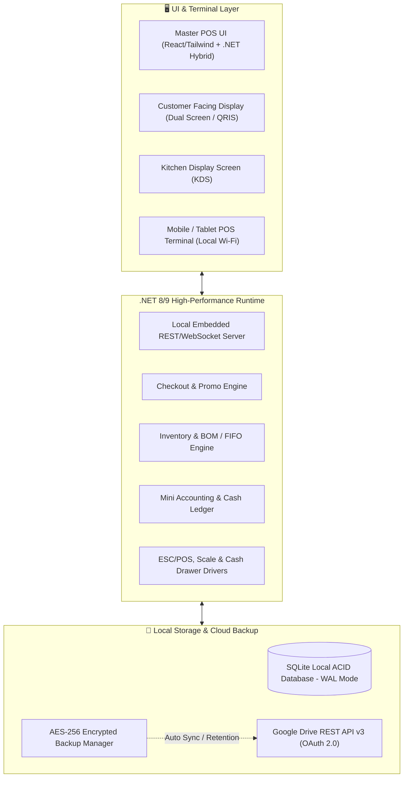
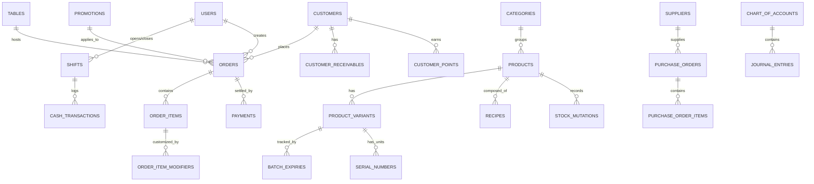

# Product Requirements Document (PRD) v2.0
## OmniPOS - Enterprise-Grade Multi-Business POS System
### Local-First, .NET High-Performance Engine, Modern Web-Like UI, & Cloud Backup

---

## 1. Executive Summary & Vision

**OmniPOS** adalah sistem Point of Sale (POS) & Manajemen Bisnis all-in-one kelas profesional yang dirancang untuk beroperasi secara mandiri (*Local-First / Zero-Server Maintenance*) dengan performa tinggi menggunakan ekosistem **.NET**, antarmuka modern yang sangat interaktif dan responsif bergaya **Web/React**, serta sistem pencadangan otomatis terenkripsi ke **Google Drive**.

### Prinsip Desain Utama
1. **100% Offline-First & Resilient**: Berjalan lancar tanpa internet. Transaksi, pencatatan kas, dan cetak struk tidak boleh terganggu oleh masalah koneksi.
2. **Universal Multi-Business Preset**: Satu aplikasi yang dapat disesuaikan untuk Retail, F&B, Jasa/Services, Apotek, hingga Toko Elektronik/Fashion.
3. **Slick & Ergonomic UI**: Desain modern (Dark/Light mode, Glassmorphism, Keyboard shortcuts, Touch-screen friendly, Zero lag).
4. **Enterprise Multi-Terminal LAN Mesh**: Mendukung 1 Master PC + Multi-Terminal Kasir/Pelayan via Wi-Fi lokal tanpa perlu internet dan tanpa server cloud.
5. **Zero Data Loss**: Otomasi backup terenkripsi AES-256 ke Google Drive dengan kebijakan retensi cerdas (*rolling backup*).

---

## 2. Business Modes & Industry Presets

OmniPOS menyediakan mode operasional yang dapat diaktifkan sesuai jenis usaha:

```
+-----------------------------------------------------------------------------------+
|                              OMNIPOS CORE ENGINE                                  |
+---------------------+--------------------+-------------------+--------------------+
|  🛒 RETAIL & GROCERY| ☕ F&B & RESTO     | ✂️ SERVICES & JASA | 💊 APOTEK & GADGET |
|  - Fast Barcode Scan| - Table Floor Map  | - Queue / Booking | - Batch & Expiry   |
|  - Wholesale Tiers  | - KDS (Kitchen)    | - Service Status  | - IMEI/Serial No   |
|  - Digital Scale    | - Split Bill & Mod | - Staff Commission| - Consignment      |
+---------------------+--------------------+-------------------+--------------------+
```

| Mode Industri | Fitur Unggulan Utama |
| :--- | :--- |
| **Retail, Minimarket, Grosir** | Continuous barcode scanning, harga grosir bertingkat (*wholesale pricing*), integrasi timbangan digital curah, cetak label barcode rak. |
| **F&B (Cafe, Restoran, Bakery)** | Visual Table Management (denah meja), Kitchen Display System (KDS), varian & modifiers (level gula, topping), split bill, menu bundling & resep bahan baku (BOM). |
| **Jasa (Laundry, Salon, Bengkel, Cuci Mobil)** | Manajemen antrean (*Queue*), pelacakan progres pengerjaan (Pending $\rightarrow$ Proses $\rightarrow$ Selesai $\rightarrow$ Diambil), komisi staf/teknisi, uang muka (DP). |
| **Apotek, Farmasi, Frozen Food** | Pelacakan Batch Number & Tanggal Kadaluarsa (FEFO), peringatan stok kadaluarsa. |
| **Elektronik, Gadget, Fashion** | Pelacakan Serial Number / IMEI unik per unit barang, kartu garansi, matrix varian (Ukuran x Warna). |

---

## 3. Arsitektur Teknologi & Spesifikasi Sistem



### Rincian Stack:
* **Core Engine**: **C# / .NET 8 / .NET 9** (Performa tinggi, AOT compilation ready, memori efisien).
* **UI Presentation**: **.NET Hybrid (Photino.NET / .NET MAUI Blazor Hybrid) + React / TailwindCSS / Lucide-React / Shadcn UI / Chart.js**.
* **Local Database**: **SQLite + Entity Framework Core / Dapper** (Single file `pos_data.db`, WAL Mode, ACID compliant).
* **LAN Mesh Sync**: **Kestrel Embedded Web Server + SignalR / WebSockets** (Koneksi instan antar perangkat kasir/dapur di jaringan Wi-Fi lokal yang sama tanpa internet).
* **Cloud Backup**: **Google.Apis.Drive.v3** dengan enkripsi **AES-256-GCM** dan kompresi Zip.
* **Hardware Drivers**: Raw socket & serial communication untuk Thermal Printer (ESC/POS 58mm/80mm), Barcode/QR Scanner, Cash Drawer, dan Timbangan Digital (RS-232/USB).

---

## 4. Rincian Modul & Fitur Lengkap (Complete Feature Matrix)

---

### 4.1. Modul Kasir & Transaksi (Checkout Engine)
* **Pencarian Cepat & Input Multi-Mode**:
  - Barcode / SKU scanning dengan continuous scanning (tanpa perlu klik mouse).
  - Visual Grid Produk dengan kategori tab, foto produk, dan pencarian instan (*fuzzy search*).
  - Full Keyboard Shortcuts (F1 Cari, F2 Diskon, F3 Customer, F4 Hold, F9 Bayar, Enter Selesai, Esc Batal).
* **Varian, Modifiers & Addons**:
  - Varian dinamis (Contoh: Ukuran: Regular/Large, Warna: Merah/Biru).
  - Modifier tambahan (Contoh F&B: *Extra Shot +Rp 5.000*, *Less Sugar*, *No Ice*).
* **Fitur Transaksi Lanjutan**:
  - **Hold & Resume Multiple Orders**: Simpan tak terbatas transaksi tertunda dan lanjutkan kapan saja.
  - **Split Bill & Merge Bill**: Pisah tagihan berdasarkan nominal, per item, atau per kursi/meja.
  - **Uang Muka / Pre-Order (Down Payment)**: Terima DP, cetak tanda terima DP, dan pelunasan di kemudian hari.
  - **Retur & Pengembalian (Refund & Exchange)**: Retur barang parsial/penuh dengan validasi struk lama, opsi refund tunai atau *Store Credit*.
  - **Cash Rounding (Pembulatan Kembalian)**: Pembulatan ke nominal 100, 500, atau 1.000 terdekat.
* **Dukungan Pembayaran Fleksibel (Multi-Payment)**:
  - Tunai (Cash) dengan tombol pecahan uang pas cepat (*Quick Cash Buttons*).
  - **QRIS Dinamis Otomatis**: Generator QRIS standar EMVCo dengan nominal langsung tersemat di QR code.
  - Kartu Debit / Kredit (Input no. referensi EDC / Approval Code).
  - Transfer Bank & E-Wallet.
  - **Split Payment**: Kombinasi pembayaran (contoh: 50% Cash + 50% QRIS).
  - **Piutang Pelanggan (Kasbon / Pay Later)**: Khusus pelanggan terdaftar dengan batas limit kredit (*Credit Limit*) dan tanggal jatuh tempo.
* **Dual Screen / Customer Facing Display (CFD)**:
  - Menampilkan keranjang belanja live ke layar kedua yang menghadap pelanggan.
  - Menampilkan QR code QRIS dinamis besar saat proses pembayaran.
  - Menampilkan banner promosi/iklan saat kasir sedang tidak melayani transaksi.

---

### 4.2. Modul F&B, Resto, Cafe & Dapur Khusus
* **Visual Table Floor Plan**:
  - Editor denah meja visual drag-and-drop per area/lantai (Indoor, Outdoor, Lantai 2, VIP).
  - Indikator status meja dengan warna (*Kosong, Terisi, Menunggu Makanan, Siap Bayar, Perlu Dibersihkan*).
  - Pindah Meja (*Move Table*) & Gabung Meja (*Merge Table*).
* **Kitchen Display System (KDS) & Cetak Tiket Dapur**:
  - Layar monitor khusus dapur dengan update real-time via WebSocket lokal.
  - Filter pesanan per stasiun (Stasiun Bar/Minuman, Stasiun Dapur/Makanan Panas).
  - Tombol status pengerjaan: *Baru Masuk $\rightarrow$ Sedang Dimasak $\rightarrow$ Siap Saji*.
  - Cetak otomatis Kitchen Order Ticket (KOT) ke thermal printer dapur.
* **Menu Bundling & Resep Bahan Baku (Bill of Materials - BOM)**:
  - Menu kombo (contoh: Paket Hemat = Burger + Kentang + Es Teh).
  - Resep bahan baku otomatis memotong stok bahan mentah saat menu jadi terjual.
  - Manajemen bahan setengah jadi / prep items (contoh: batch kaldu atau saus rahasia).

---

### 4.3. Modul Retail, Apotek, Minimarket & Elektronik
* **Batch & Expiry Date Management (FEFO)**:
  - Pencatatan nomor batch dan tanggal kadaluarsa saat penerimaan barang.
  - Sistem otomatis menyarankan pengeluaran barang dengan kadaluarsa terdekat (*First Expired, First Out*).
  - Peringatan dini (*Early Warning Alert*) untuk barang mendekati ED (30, 60, 90 hari).
* **Serial Number & IMEI Tracking**:
  - Input Serial Number / IMEI saat stok masuk dan saat penjualan di kasir.
  - Pencarian riwayat garansi berdasarkan no IMEI / Serial Number.
* **Integrasi Timbangan Digital (Scale Integration)**:
  - Membaca timbangan elektrik langsung melalui koneksi serial RS-232 / USB.
  - Membaca barcode berbobot/berharga (*Weight/Price Embedded Barcode*) dari timbangan terpisah.
* **Sistem Konsinyasi (Barang Titipan)**:
  - Manajemen supplier konsinyasi, persentase bagi hasil toko, dan laporan berkala barang titipan yang laku untuk penyelesaian dana.

---

### 4.4. Modul Jasa, Booking & Manajemen Antrean (Services)
* **Manajemen Antrean & Pelacakan Status Jasa**:
  - Nomor antrean otomatis (dapat ditampilkan di TV monitor ruang tunggu).
  - Status pengerjaan: *Menunggu $\rightarrow$ Dikerjakan $\rightarrow$ Selesai/Siap Diambil $\rightarrow$ Sudah Diambil*.
  - Cetak tanda terima nota servis/laundry beserta estimasi waktu selesai.
* **Komisi Staf & Terapis / Mekanik**:
  - Penugasan staf/teknisi per item layanan di kasir.
  - Perhitungan otomatis komisi (Persentase % atau Nominal Rupiah Tetap).
  - Laporan rekapitulasi komisi staf per periode penggajian.

---

### 4.5. Modul Inventori, Stok, Multi-Satuan & Pembelian
* **Multi-Satuan Bertingkat (UOM Conversion)**:
  - Contoh: 1 Dus = 24 Renceng = 240 Sachet. Kasir bisa menjual dalam satuan apa saja dengan pemotongan stok yang presisi.
* **Operasional Stok Lengkap**:
  - **Purchase Order (PO) & Penerimaan Barang**: Dari supplier beserta pencatatan hutang dagang.
  - **Stok Keluar / Waste / Damage**: Pencatatan barang rusak, tumpah, atau kadaluarsa dengan akun beban kerugian.
  - **Stok Opname (Penyesuaian Fisik)**: Form opname cepat, deteksi selisih lebih/kurang, dan adjustment otomatis.
  - **Histori Mutasi Stok (Stock Ledger Card)**: Rekam jejak keluar-masuk barang per transaksi detik per detik.
* **Kalkulasi HPP & Valuasi Stok**:
  - Metode penentuan HPP: **Rata-rata Tertimbang (Weighted Average)** atau **FIFO**.
  - Laporan total nilai valuasi aset stok gudang.
  - Notifikasi stok menipis (*Low Stock Threshold*) dan stok habis (*Out of Stock*).

---

### 4.6. Modul Promo Engine & Customer Loyalty (CRM)
* **Rule Engine Diskon & Promosi Cerdas**:
  - **Buy X Get Y** (Beli 2 Gratis 1 / Beli Barang A Gratis Barang B).
  - **Happy Hour Promo** (Diskon otomatis aktif berdasarkan hari & jam tertentu).
  - **Diskon Bertingkat (Tier Quantity)**: Beli 1-5 harga normal, 6-11 diskon 5%, $\ge 12$ diskon 10%.
  - **Diskon Minimal Belanja** (Belanja > Rp 200.000 dapat potongan Rp 20.000).
  - **Voucher Promo & Kupon Diskon** (Kode kupon unik, kuota penggunaan, periode aktif).
* **Program Loyalitas Member**:
  - Poin belanja (Contoh: Tiap Rp 10.000 = 1 Poin; 100 Poin = Diskon Rp 5.000).
  - Tingkatan Member (*Tiering*: Bronze, Silver, Gold, Platinum) dengan benefit diskon otomatis.
  - **Dompet Deposit Saldo Member (Stored-Value Account)**: Member bisa top up saldo deposit di toko untuk belanja tanpa uang tunai.
* **WhatsApp Gateway / Digital Receipt**:
  - Integrasi pengiriman struk digital & rincian garansi langsung ke WhatsApp pelanggan.
  - Pengingat jatuh tempo kasbon piutang via WhatsApp.

---

### 4.7. Modul Kas Laci, Shift & Manajemen Kas (Cash Drawer & Shifts)
* **Manajemen Shift Kasir**:
  - **Buka Shift**: Input modal awal kas laci (*Starting Float*).
  - **Tutup Shift (Blind Cash Count)**: Kasir menginput uang fisik aktual tanpa melihat angka sistem terlebih dahulu untuk mencegah manipulasi.
  - Kalkulasi otomatis selisih kas (*Cash Over/Short Discrepancy*).
* **Laporan X-Report & Z-Report**:
  - **X-Report**: Ringkasan penjualan sementara di tengah shift.
  - **Z-Report**: Laporan resmi penutupan shift/harian dengan cetak fisik struk ringkasan.
* **Arus Kas Kecil (Petty Cash)**:
  - Kas Masuk Operasional (Tambahan modal, penerimaan non-penjualan).
  - Kas Keluar Operasional (Beli plastik, bayar listrik, uang kebersihan, uang makan staf).

---

### 4.8. Modul Multi-User, Hak Akses (RBAC) & Keamanan Kasir
* **Hierarki Role Pengguna**:
  - **Owner / Super Admin**: Akses penuh seluruh modul, laba rugi, konfigurasi sistem, dan backup.
  - **Manager / Supervisor**: Mengelola stok, harga, laporan penjualan, dan otorisasi void.
  - **Kasir (Cashier)**: Operasional kasir, buka/tutup shift sendiri, riwayat transaksi shift berjalan.
  - **Dapur / Kitchen**: Layar KDS & antrean makanan.
* **Keamanan Kasir**:
  - **Quick PIN Login & 1-Second Screen Lock**: Kunci layar instan saat kasir meninggalkan meja.
  - **Supervisor PIN Approval Dialog**: Membutuhkan PIN supervisor untuk:
    - Menghapus item yang sudah diinput (*Void Item*).
    - Membatalkan transaksi (*Cancel Order*).
    - Memberikan diskon manual di atas batas wewenang kasir.
    - Membuka laci kas tanpa transaksi (*No-Sale Drawer Kick*).
* **Audit Trail Log**:
  - Rekam jejak seluruh aktivitas sensitif (siapa yang melakukan, kapan, item apa, alasan apa).

---

### 4.9. Modul Mini Akuntansi & Laporan Finansial Komprehensif
* **Bagan Akun (Chart of Accounts)**:
  - Akun Kas & Bank, Piutang Usaha, Persediaan Barang, Aset, Hutang Usaha, Modal, Pendapatan Penjualan, HPP, dan Beban Operasional.
* **Jurnal Otomatis (Automatic Bookkeeping)**:
  - Setiap transaksi penjualan, HPP, pembelian stok, dan petty cash otomatis menghasilkan jurnal debit-kredit.
* **Laporan Keuangan Standar**:
  - Laporan Laba Rugi Komprehensif (Penjualan Bersih - HPP = Laba Kotor; Laba Kotor - Beban = Laba Bersih).
  - Laporan Neraca Saldo (Posisi Aset, Liabilitas, dan Ekuitas).
  - Laporan Arus Kas (Cash Flow Statement).
* **Laporan Analitik Bisnis**:
  - Grafik tren penjualan harian, mingguan, bulanan.
  - Produk Terlaris (*Top Selling Items by Qty & Revenue*) & Produk Kurang Laku (*Dead Stock*).
  - Analisis Jam Sibuk (*Peak Sales Hours Heatmap*).
  - Rekapitulasi Pembayaran (Cash vs QRIS vs Card vs Piutang).
  - Ekspor ke Excel (.xlsx), PDF, dan CSV.

---

### 4.10. Modul Multi-Terminal Local Mesh (LAN Sync)
* **Master POS & Worker Terminal Network**:
  - PC Kasir Utama bertindak sebagai **Local Host Server** (via Kestrel/SignalR embedded).
  - Tablet/Laptop pelayan (*Waiters*) terhubung ke PC Kasir via Wi-Fi toko tanpa perlu internet.
  - Pesanan dari tablet waiter langsung masuk ke antrean kasir dan printer/layar dapur secara *real-time*.

---

### 4.11. Modul Google Drive Cloud Backup & Disaster Recovery
* **Google Drive API v3 Integration**:
  - Otentikasi aman OAuth 2.0 (Login dengan akun Google toko).
  - Folder otomatis di GDrive: `OmniPOS_Backups/`.
* **Strategi & Keamanan Backup**:
  - **Pemicu Backup**: Otomatis saat Tutup Shift (Z-Report), Otomatis Terjadwal Harian (Jam 23:59), atau Tombol 1-Click Manual.
  - **Enkripsi AES-256-GCM**: Database SQLite disalin via `VACUUM INTO` lalu dikompres dan dienkripsi dengan Master Key sebelum diunggah.
  - **Rolling Backup Policy (Auto-Purge)**: Menjaga maksimal 30 backup terbaru di Google Drive, menghapus arsip lama secara otomatis agar kapasitas GDrive tetap lega.
* **Disaster Recovery (1-Click Restore)**:
  - Antarmuka daftar file backup yang tersedia di cloud.
  - Fitur 1-Click Restore dengan verifikasi integritas checksum SHA-256 dan auto-backup protektif sebelum restore.

---

### 4.12. Modul Pengaturan Toko & Receipt Customizer
* **Informasi Toko**: Nama Toko, Cabang, Alamat, Telepon, NPWP/NIB, Logo, Footer Pesan, Akun Sosmed.
* **Visual Receipt Designer**:
  - Desain struk thermal 58mm & 80mm.
  - Pengaturan header, footer, logo toko, cetak barcode nota, potong kertas otomatis (*Auto-cutter*), dan buka laci otomatis (*Cash Drawer Kick*).
* **Tema UI**:
  - Dark Mode & Light Mode dengan aksen warna yang dapat dipilih.
  - Responsive layout (kompatibel untuk layar sentuh kasir 10", 15", maupun layar monitor desktop ultrawide).

---

## 5. Kebutuhan Non-Fungsional (NFR) & Performa

1. **Kecepatan & Responsivitas**:
   - Respon penambahan item via barcode scanner $< 30\text{ ms}$.
   - Waktu buka aplikasi $< 2\text{ detik}$.
   - Waktu cetak struk kasir $< 300\text{ ms}$.
2. **Integritas Data (ACID & WAL Mode)**:
   - Data aman 100% dari kerusakan akibat mati listrik tiba-tiba (*Zero database corruption*).
   - Penggunaan tipe data `decimal` C# untuk akurasi perhitungan uang tanpa selisih pembulatan floating-point.
3. **Kompatibilitas Hardware**:
   - Kompatibel dengan semua printer thermal USB/Bluetooth/LAN berbasis ESC/POS standar.
   - Kompatibel dengan barcode scanner USB/Wireless (HID Mode & Virtual COM).
   - Kompatibel dengan cash drawer RJ-11/RJ-12 yang terhubung ke printer.

---

## 6. Struktur Skema Database Utama (SQLite)



---

## 7. Roadmap Implementasi Pengembangan

1. **Sprint 1: Fondasi Arsitektur, Local Database & Core Setup**
   - Inisialisasi arsitektur proyek .NET dengan UI Hybrid (React/Tailwind/Shadcn).
   - Setup SQLite Database dengan Entity Framework Core (WAL mode), migrasi skema lengkap.
   - Setup Dependency Injection, Repository Pattern, dan Logging.
2. **Sprint 2: Katalog Produk, Varian, Multi-Satuan & Stok / BOM**
   - CRUD Produk, Varian, Kategori, Modifier, Multi-Satuan.
   - Manajemen Resep (BOM), Batch/Expiry, dan Serial Number.
   - Logika HPP (Weighted Average/FIFO) & Mutasi Stok.
3. **Sprint 3: Layar Kasir (POS Checkout Engine) & Hardware ESC/POS**
   - UI Kasir modern, touch-friendly, barcode continuous scan, keyboard shortcuts.
   - Keranjang, Split Bill, Diskon, Pajak, Hold Orders, Retur, DP/Indent.
   - Integrasi ESC/POS thermal printing & Cash Drawer kick.
4. **Sprint 4: Modul F&B (Denah Meja & KDS) / Retail / Services Preset**
   - Visual Table Floor Plan & status meja.
   - Kitchen Display Screen (KDS) via SignalR lokal.
   - Mode Servis & komisi staf.
5. **Sprint 5: Shift Kasir, Petty Cash & Keamanan RBAC**
   - Buka/Tutup Shift, Blind Cash Count, X/Z-Report.
   - Arus kas kecil operasional.
   - Role permission, PIN login, dan Supervisor Void Approval modal.
6. **Sprint 6: Promo Engine, Customer CRM, Poin & Piutang Kasbon**
   - Diskon otomatis (Buy X Get Y, Happy Hour, Grosir).
   - Member tiering, saldo deposit pelanggan, kasbon & cicilan.
7. **Sprint 7: Mini Akuntansi & Dashboard Analitik Finansial**
   - Jurnal otomatis, Laba Rugi, Neraca, Arus Kas.
   - Dashboard analitik grafik penjualan, produk terlaris, ekspor Excel/PDF.
8. **Sprint 8: Google Drive Automated Backup & Multi-Terminal Sync**
   - OAuth 2.0 Google Drive API v3 integration.
   - Auto backup terenkripsi AES-256, rolling retention, dan 1-Click Restore.
   - LAN multi-terminal sync testing dan final polishing.

---

*Dokumen PRD v2.0 ini adalah cetak biru resmi (blueprint) arsitektur fungsional dan teknis sistem OmniPOS.*
